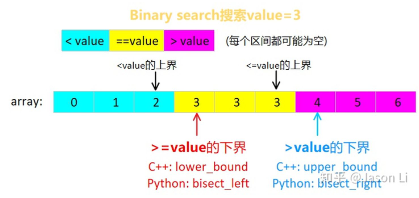

## 下界和上界
* 下界：插入第一个位置，不打破顺序
* 上界：插入最后位置，不打破顺序

```C++
int lower_bound(vector<int>& array, int first, int last, int value)
{
  while(first < last)
  {
    auto mid = first + (last - first) /2;
    if (array[mid] < value)
      first = mid + 1;
    else
      last = mid;
  }
  return first; // last也行，此时重合
}
```
## 二分法写法
关键是[first, last) 左闭右开。  
  
二分法找的是四个箭头中一个，C++只提供找下界的函数，下标减1既可获得相邻互补的上界。如果只需找任意一个黄色value，可直接找红箭头，在检查是否等于value。

## 搜索区间和中点
1. 求下界：`x >= value`或`x > value`的最小x位置，用左闭右开搜索区间`[first, last)`，区间为空时终止并返回first或last(last == first)。  
2. 中点：mid = first + (last - first) /2， 从first出发，确保区间长度为1时，mid = first仍在`[first, first +1]`
3. 求上界：`x < value`或`x <= value`的最大x位置，可用互补的求下界函数减1得到。如`x >= value`的下界就是`x < value`的上界。

## C++中函数
* lower_bound(value)：找`x >= value`下界，若为last则不存在
* upper_bound(value)：找`x > value`下界，若为last则不存在
* lower_bound(value) - 1：`x <= value`上界，若为first-1则不存在
* upper_bound(value) - 1: `x <= value`上界，若为first-1则不存在
