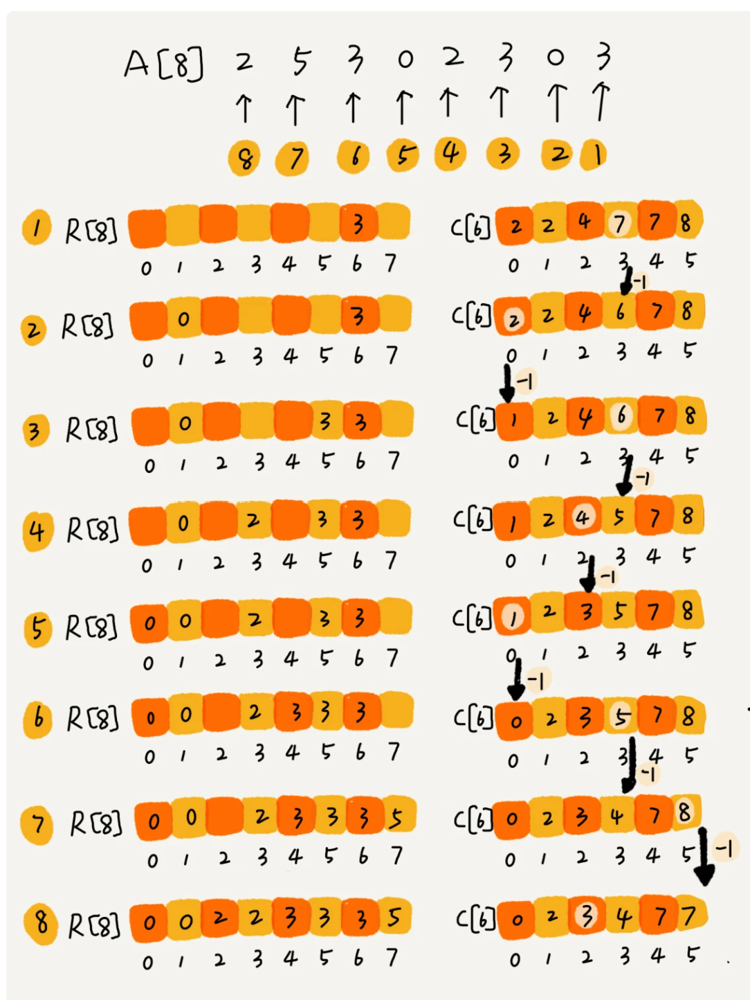

## 排序算法稳定性
待排序的序列中存在值相等的元素，经过排序之后，相等元素之间原有的先后顺序不变。如要给订单排序，订单有两个属性：下单时间和金额。希望按金额从小到大排序，对相同金额的按照下单时间从早到晚排序。  
可`先按下单时间`排序，__再使用稳定排序按金额排序__。因为第一次已经按照下单时间排好序了，第二次排序中，相同金额订单仍然保持下单时间从早到晚有序。  

## 插入排序比冒泡排序更受欢迎
对逆序度为K的数组进行排序，用冒泡，需K次交换，每次需3个赋值语句。对插入只需K个移动。

##
插入、冒泡均是稳定排序，最好为O(n)，选择排序不是稳定排序，且均为O(n^2)

## 线性排序
### 桶排序
  
假设要排序的数据有n个，均匀划分到m个桶内，每个桶有k=n/m个，内部使用快排，时间复杂度O(klogk)。总排序O(nlog(n/m))，当m接近于n，log(n/m)很小常量，桶排序复杂度接近于O(n)。__桶排序适合用在外部排序中__，数据量比较大，内存有限。如10GB订单数据，按照订单金额排序。先扫描一遍文件，看订单金额的数据范围。假设经过扫描后发现金额最小1元，最大10万元。将订单金额划分到100个桶里。
### 计数排序
是桶排序特殊情况。适用在数据范围不大的场景。  
  
### 基数排序
对10万个手机号码排序，如果前面几位a比b大，后面几位不用看了。  
  
每位来排序的算法要是稳定的。

## 快速排序
stl中快排：
1. 三点中值（取整个序列的头、尾、中央三个位置的元素，以其中值作为枢纽。）
2. 递归分割序列时，序列的长度会越来越短，短序列排序中插入排序效率最高，可设定阈值，序列长度分割到阈值时切换到插入排序，提高效率
3. 序列中存在大量相同元素，或全是相同元素时，使用快排仍会得到最低效率，可采用聚集相同元素的方法，每次选择哨兵后，将与哨兵相同的元素放到序列中间，下次分割时中间这些值不参与分割。
4. 递归层数较深时采用堆排序。  
